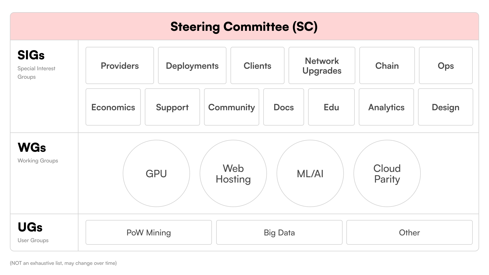

# Akash Network Community

Welcome to the Akash Network community!

This is the starting point for joining and contributing to building Akash Network - committing code, writing docs, testing product features & reporting bugs, organizing meetups, suggesting ideas for new features, and more.

## Getting Acquainted

- To learn about the types of community groups read the rest of this document.
- To see a full list of current Akash Network community groups, see: [community/cg-list](cg-list)
- To learn about our product strategy & prioritization framework, see: [community/product-strategy](product-strategy)
- To see a list of projects being worked on or under consideration see: [community/project-list](projects-list)

## Getting started with contributing

The Akash Network community welcomes contributions from community members at various levels of technical ability and familiarity with Akash. If you are interested in contributing to the project, please read through the "Getting Acquainted" section first. Then, join our discord server and refer to the below table to choose a starting point based on your skillset.

| Your background | Suggested starting point for contribution |
| --- | --- |
| Non-technical, Never used Akash | [Review docs](https://docs.akash.network/) and attempt deploying a tetris game on Akash. Suggest any changes or improvements to the documentation by filing an issue in [sig-documentation](sig-documentation). |
| Frontend (node, JS) developer, Never used Akash | [Review docs](https://docs.akash.network/) and deploy an application. Review code base for Akash Console or Cloudmos Deploy, set up local environment. Review open issues for either project, choose something (like a simple bug fix) that interests you and add a comment or submit a PR for review. |
| Backend (Go) developer, Never used Akash | [Review docs](https://docs.akash.network/) and deploy an application on Akash using CLI. Review code base for Akash CLI and Provider Services, set up local development environment. Review open issues for either code base and comment on potential solution to any problem and/ or submit PR for review. |
| Technical developer, Already building on Akash | Considering joining one of our [SIGs](cg-list), [WGs](cg-list) and writing a spec for one of the projects in the list or suggest a new prjoject to add to the [list of projects](projects-list). |

## Community Groups

The Akash Network community groups are insipired by the [Kubernetes project](https://github.com/kubernetes/community) and currently consist of the following groups. As our community evolves, we will consider changing this structure as needed. All groups listed below are open to anyone interested in participating in them, except "Committees" that have preassigned members.

### Special Interest Groups (SIGs)

SIGs are vertically specialized community groups that are working on foundational elements of Akash Network by implementing and supporting products that are defined by the working groups or smaller feature ideas. **SIGs may generally be involved in both defining (spec’ing) as well as building specific products and features. SIGs are persistent groups in that they exist forever.**

### Working Groups (WGs)

WGs are horizontally aligned community groups that pursue significantly large cross-cutting initiatives involving multiple SIGs. **WGs do not work on implementing features or projects but will be involved in defining (PRD-style) large projects with multiple components across the entire stack** and potentially involving non-Akash partners and stakeholders as well. **Working groups may be active for days, weeks or months but are generally not considered “persistent” like SIGs.**

### User Groups (UGs)

UGs are for facilitating open communication and discovery of topics that may end up in WGs or SIGs. These may also be groups discussing broad use cases like ML/AI or Big Data. Lastly, these may be things that we don’t prioritize for product development based on our current strategy but still things that people want to discuss.

### Committees

Committees are named sets of people that are chartered to take on sensitive topics. This group is encouraged to be as open as possible while achieving its mission but, because of the nature of the topics discussed, private communications are allowed. Examples of committees include the Steering Committee and things like 'security' or 'code of conduct.'

- #### Steering Committee
  
    The [Steering Committee](committee-steering/README.md) is a special SIG that periodically evaluates the list of projects, prioritizes/adds/removes items and decides which SIG or WG is best suited to tackle the project. The Steering Committee also regularly meets to incorporate learnings to improve how the Akash Network community operates and will perform conflict resolution as necessary.

### Examples

To see a list of projects being worked on or under consideration see [community/project-list](projects-list)

- - A “wg-gpu” that works on end-to-end execution of what it will take for Akash Network to support GPUs. This may include specifications for changes to Deployments (SDL) and Providers, deciding on what vendors and models of GPUs fit with our customer use cases, figure out the best partnerships for sourcing GPU inventory for those models, decide whether we need to solve bandwidth pricing, running alpha/beta testing, etc.  The GPU-WG's work will potentially result in multiple projects being created for the “Providers-SIG”, the “Deployments-SIG”, the “Economics-SIG” and so on. These SIGs will define a lower-level spec for their specific area (based on the overall high-level spec defined by the GPU-SIG), and implement it.
  
- An “wg-ethereum” that is focused on understanding how Akash Network can be adopted by the Ethereum ecosystem. They would define a strategy that includes: technical requirements for node operators and developers, along with non-technical things like events and Discord communications. These would also result in multiple projects for various SIGs.

- Projects like the “provider microservices split” do not require a working group as they only pertain to the provider's code base and, as such, are just handled by the “sig-provider.”

- Support for Authorized Spend in Console would be handled by the “sig-clients” and does not need a dedicated work group.
