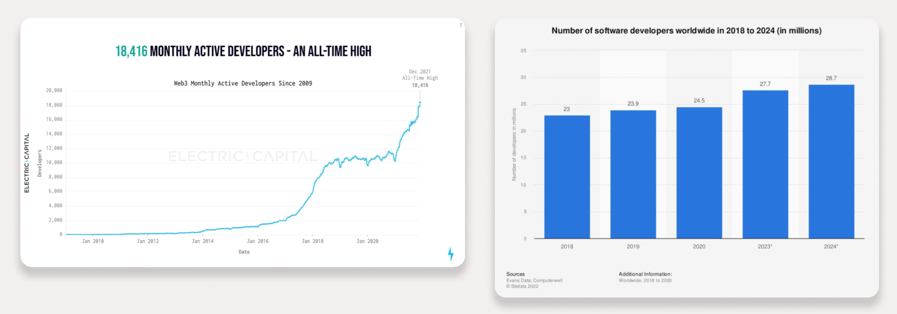

# Cloudmos Deploy 🤝 Akash Console Product Strategy

In conjunction with the governance proposal about Cloudmos and Overclock Labs joining forces, this document outlines a cohesive product strategy for how both teams, working with the broader Akash community, intend to make the merger most successful. Specifically, this post outlines a strategy for how two somewhat overlapping products (Cloudmos Deploy and Akash Console) can together expand the Total Addressable Market (TAM) for Akash Network, through clear user segmentation.

## Summary

1. Going forward, Cloudmos Deploy and Akash Console will focus on serving distinctly different user segments and work towards building the best possible UX for each
   - **Cloudmos Deploy** will continue to focus on user segments that it has proven to be very successful with - Cosmos-native Web3 developers – and expand its feature capabilities to other crypto ecosystems, including Ethereum and Solana. Stated differently, Cloudmos Deploy will strive to serve all Web3 developers and workloads, looking for a first class web UI.
   - **Akash Console** will pivot to a narrower user segment, focusing squarely on non-crypto-native developers and (at least initially) on ML & AI type workloads. Stated differently, Akash Console will strive to serve Web2 AI & ML developers and workloads, looking for a first class web UI.

2. To accelerate speed of development, both teams will work on architecting and reorganizing code to allow for maximum reuse. This is particularly important for many of the common features that matter to both (Web2 and Web3) developers.
Cloudmos Deploy will be open sourced, similar to Akash Console, to enable community participation, which we hope will also accelerate software development. 

3. The strategy will be tested and adjusted based on user & community feedback and data driven experimentation.

## Background & Context

It is no secret that the biggest growth driver for Akash Network is adoption by users on the deployment side (aka “tenants”). While clients like Cloudmos Deploy, Akash Console and others alleviate several of these challenges (and have led to a significant increase in usage of Akash Network), there is still a lot of work to do to make the developer experience on par with even products like Vercel or Netflify (which are very commonly used by website builders/ maintainers), let alone more complex platforms like AWS (used by web scale & enterprise SaaS companies).

Separate from the UX and DX challenges, just being crypto-native and Cosmos dependent (requiring users to have knowledge of crypto, have a Keplr wallet, be able to obtain AKT) is a significant limiter to the total market that Akash can address (aka the “TAM”). For reference, the total Web3 developers (<20K) are estimated to be a miniscule fraction (<1%) of the total developers in the world and Cosmos-native developers are a fraction of all Web3 developers.

*Stated differently, by making the Akash Network deployment UX Cosmos exclusive, we are limiting the market we serve, to a small fraction of the crypto developer community. But Akash Network is a general purpose cloud and does not need to limit itself.*

We think that Akash Network can be just as attractive to Web2 developers as it is to Web3 developers but we have had no way of testing whether that thesis is true. Partly because it is challenging to build a UX that appeals to both types of users, within the same product and partly because most full fledged web services (that run on public clouds like AWS, Azure or GCP) have stringent “five-9s'' requirements and a host of complementary features that Akash Network has not built out, just yet. To that end we think that the recent addition of GPUs to the Akash Marketplace, presents a rare opportunity for Akash Network to be attractive to Web2 developers, because the demands for uptime and latency and other “auxiliary” services are significantly lower for ML/ AI training workloads, when compared with mainstream (Web and SaaS type) services.

*In other words, while Akash Network is much better suited to run ML & AI training workloads (because of their batch-y nature and less stringent production requirements), we are limiting ourselves by not making ourselves friendly to those developers (a large majority of who are NOT crypto friendly) and we will miss the opportunity entirely, if we don’t solve it.*

All that said, this is just a thesis that if we remove the crypto barrier, the non-crypto users will use Akash Network. This is by no means guaranteed and needs to be tested and refined. It is entirely possible that we offer a non-crypto experience and still fail to attract developers using other platforms. In other words, this isn’t risk free.

**If only there was a way to do that and not do it at the same time!** 

## The Solution

Thanks to the Cloudmos and Overclock teams joining forces, we now have a huge opportunity at “having the cake and eating it too”. Besides the fact that the two teams are now part of the same larger team (and can come up with a cohesive product strategy as outlined here), it also helps that the software stack (and in many cases, the code bases) for both products are very similar. This would allow us to reuse code across both platforms. 

The key is to align on a strategy and execution roadmap that allows us to do this. The high level strategy and execution framework is outlined below and will be detailed and implemented in many of the upcoming SIGs and WGs within the Akash community.

## Product Strategy & Execution

### Strategy

(“Have your cake and eat it too”) 

The product strategy proposed can be summed up as follows:

1. Have a clear delineation of user segments between the two products - one serving crypto-friendly users and the other serving non-crypto-friendly users. This will be used to guide both product development (roadmaps) as well as marketing campaigns (which product is pushed where)
2. Structure code bases to make it possible to reuse common features. The roadmaps for each product are expected to have features that are specific to their users – like wallet integrations or stable payments or web3.0 integrations for crypto-friendly users and credit card payments, Web2.0 integrations and others for non-crypto users. There are also expected to be several common features (like VCS integrations, monitoring and alerting support, redeployment of workloads to backup providers etc). The goal is to ideally have reusability of the common features across both products, so as to reduce overhead of maintaining multiple implementations.
3. Have clear delineation of marketing channels. For example, the crypto friendly product will be used in campaigns and channels where we think the primary audience is crypto users (for example: Twitter, Discord, Messari, Cosmverse, EthConf etc) while the non-crypto solution will be presented to Web2.0 developer audiences (LinkedIn, Threads?, other web2 developer sites and product launch platforms like Replit and ProductHunt, Kubecon, Gophercon etc).

To execute on the above strategy we will need to answer the following questions:

1. What are the (two) desired new user experiences, based on our best understanding of pain points of each user group (crypto vs non-crypto users).
2. Based on the desired UX, what are the key features of the product that will support each new user UX. 
3. Based on the key new user features, which (Console vs. Cloudmos) product will focus on the crypto developer space and which will focus on the non-crypto developer space? 
4. What does the feature list look like for the common features? 

### Execution

#### Crypto User Onboarding UX

We think the biggest painpoints for a crypto-native or crypto-friendly user getting started, are:

1. Unfamiliarity with Cosmos and Keplr: Limits our user base to cosmos native folks.
   - Users should be able to use leading wallets for non Cosmos chains to deploy workloads
2. Challenge of sourcing $AKT
   - Users should not have to need only AKT to use Akash (should be able to pay using USDC or other leading cryptos)
   - Users should ideally be able to easily obtain the token of choice without having to register on a new exchange.
   - Ideally, users should be able to access compute resources and pay without having to create an account or provide PII (personally identifiable information)
3. Not having stability in the cost of the cloud: Cost of deployments fluctuate when the price of the $AKT token fluctuates.
This is tackled by the stable payments initiative well underway but will need a first class UX in the deployment client, to be successful.

The full UX that will address the above painpoints and more (as we discover them) will be detailed out in subsequent community work groups and SIGs.

#### Non-Crypto User Onboarding UX

The following are things we think are key to attracting non-crypto users to the platform (mostly driven by what users expect in typical Web2 SaaS products):
1. No need to have knowledge of wallets, tokens, exchanges etc
2. No need to have to pick a provider every time (should be able to assign a default provider and potentially one or two backup providers)
3. Frictionless onboarding of first-time “trials” like typical Web2 “SaaS” products: Being able to get to the “aha” moment in the shortest time possible, which means
4. No logins or credit card payments to try the product.
5. No need to understand/ learn Akash SDLs
6. No need to understand provider selection, attributes etc.

The full UX that will address the above painpoints and more (as we discover them) will be detailed out in subsequent community work groups and SIGs.

#### Product Focus

Given that Cloudmos Deploy has established itself well in the Cosmos community (including the name) and already includes user login and features a lot of different templates, we think it is better suited to be the product that focuses on Web3 developers. 

Akash Console on the other hand is relatively nascent in its feature set (no logins, no database for user data, no provider dashboard) and as a result is better suited for building out the non-crypto user experience, without having to undo a lot of functionality.

#### Common Features

Even though we will create the separation of user experiences between the two products, that separation will majorly impact only the onboarding experience and the ability to attract specific user segments. Regardless of the user type (Web2 or Web3) we expect there to be a host of other features (gaps to “cloud parity” if you will) and there is little debate about whether it is worth solving them or not. These include (but not limited to):
1. **CI/ CD Workflow**: Trigger deployments through a PR commit process via common VCSs like Github, including being able to specify a primary and fallback providers to choose from, so as to overcome the “bid selection” manual process.
2. **SLA and Uptime**: Assurance that the workload will remain up, regardless of what happens to the providers - handled through a combination of primary and backup provider selection, as well as backup and re-deploying of the workloads.
3. **Monitoring and Alerting**: Being able to easily set up monitoring for your application with ready available APM and logging tools as well as potentially getting alerted and notified when certain conditions are met.
4. **Advanced provider matching**: Better matching of providers based on workloads, using a more intelligent selection algorithm, combined with more extensive provider attributes or inventory of capabilities.
5. **Integrations with other complimentary web services**: Most webscale workloads expect to see a bunch of other services when choosing to run their workloads in a cloud, as called out here under the “cloud parity” section.

And more.

Many of these challenges were also detailed out by the Cloudmos team in their funding proposal presented earlier this year: https://github.com/orgs/akash-network/discussions/85. In other words, this strategy aligns well with what was outlined there and was a key consideration in the two teams deciding to join forces together.

In summary, we couldn’t be more excited for this new phase in our journey to building the Akash Network “supercloud” for all developers, and hope you are too. If you are a developer interested in using Akash Network for your needs or an open source contributor and want to help shape the user experience, reach out to us learn about how you can help build either Cloudmos Deploy or Akash Console or the core features that power both.