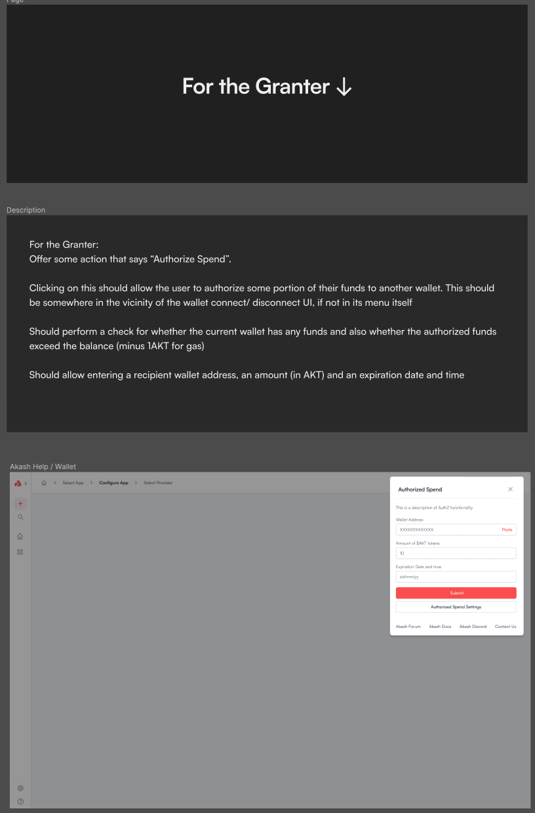
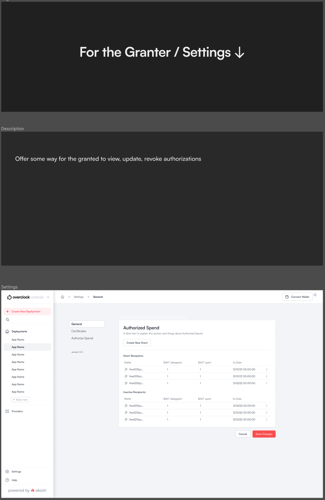
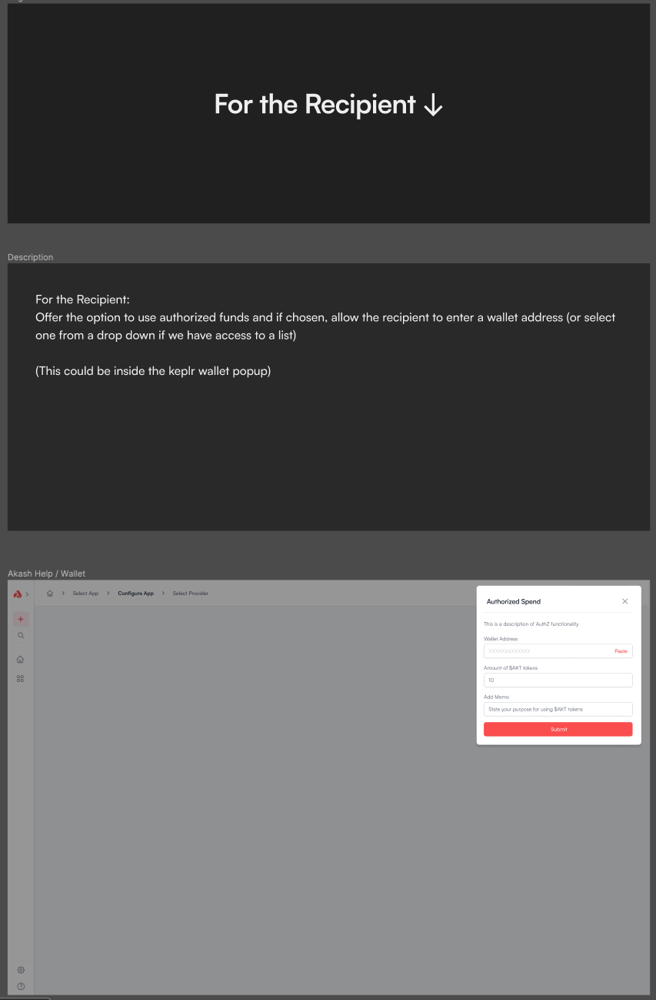
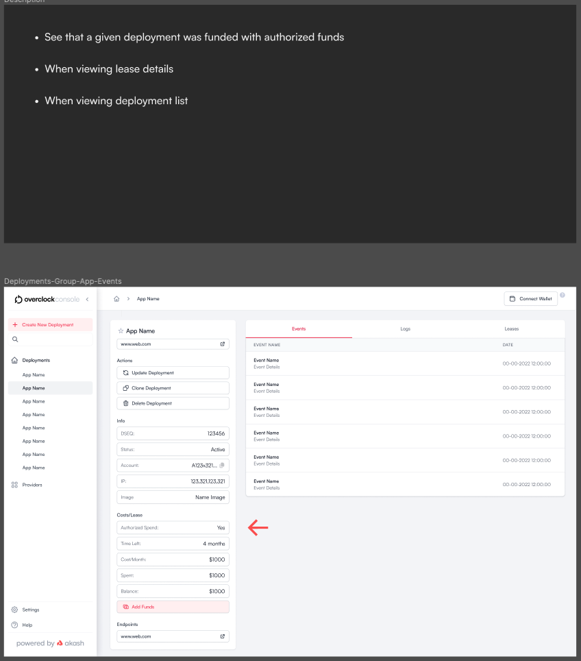

# PRD - Authorized Spend in Akash Console

## Background & Context

With the MVP of Akash Console out in beta and GA imminent, we would like to focus on enabling adoption of Console. One key aspect of driving adoption is to make it easy for people to get started, without having to acquire AKT tokens. One way to achieve this, is to fund their wallet with some AKT tokens that can be used for "playing around" with Akash Console, in a similar motion as cloud providers offer "free credits" to get started with a given public cloud.

[Authorized Spend](https://docs.akash.network/features/authorized-spend) (aka "AuthZ") is a way for a wallet to authorize another wallet for a certain amount of AKT, that maybe used only for deploying workloads on Akash Network.

Authorized spend lets:
- A given user with a keplr wallet, authorize some other user (another keplr wallet) to use a portion of the AKT in the first users wallet for the sole purpose of deployments on Akash
- A given user (wallet) that has been authorized by another user (wallet) should be able to use those funds for Akash deployment.

## Problem Statement

In order to enable growth and adoption of Akash Console, Authorized spend needs to be supported. This involves building UI and UX for two types of users as outlined below.

## User Types

### Granter (Authorizer User)

The Granter is an Akash Console user with a connected wallet with some funds in it, who wishes to grant another person some of those funds for deployment. This user persona may be a  marketing person or an Akash user who is a manager of a team of engineers, granting some AKT to a team member from a common wallet.

### Grantee/ Recipent (Authorized User)

This is the user that wants to use funds from another user’s wallet for deployments. The user persona could be a customer/ marketing-lead that is responding to a promotion from the Akash Network marketing team or it could be a engineer in a customer’s team, who is wanting to use funds from their manager’s wallet (the grantee) to perform deployments of their services on to Akash Network.

## Relevant CLI commands:

### Granter Related Commands

1. Authorize Funds:
   > akash tx deployment authz grant [deploy-wallet] [fund-amount] --from [funding-wallet]
2. List authorizations for a given wallet pair: 
   > akash query authz grants [funding-wallet] [deploy-wallet]
3. List ALL authorizations for a given Granter:
   > akash query authz granter-grants [funding-wallet-address] 
4. Change amount of funds authorized:
   > akash tx deployment authz grant [deploy-wallet] [fund-amount] --from [funding-wallet] --gas-prices="0.025uakt" --gas="auto" --gas-adjustment=1.5 -y
5. Revoke AuthZ access:
   > akash tx deployment authz revoke <deploy-wallet> --from <funding-wallet>

### Grantee Related Commands

1. Create deployment using authorized funds:
   > akash tx deployment create --depositor-account [funding-wallet] --from [deploy-wallet] deploy.yaml --gas-prices="0.025uakt" --gas="auto" --gas-adjustment=1.5 -y 

## Product Requirements

We want to support Authorized spend via Akash Console. These are the requirements we would like to support:

### Granter/ Authorizer Requirements

1. The Granter should be able to authorize another wallet to use some funds for deployment:
  a. Should be able to initiate this workflow from the UI.

  b. Should be able to specify the amount (in AKT) to authorize. This cannot exceed the total available funds in the current user’s wallet (ideally, minus some funds for gas fees to actually perform the authZ action).

  c. Should be able to specify the wallet address of the wallet they wish to authorize
  d. Should be able to specify an expiration date and time for when the authorization expires and the funds are no longer available to the grantee.

2. The Granter should be able to authorize more than one account, as long as the sum of total funds authorized + some gas fees (1AKT) is less than or equal to the funds in their wallet.

3. The Granter should be able to revoke the authorization: Some action in the UI to end authorization at a time even before the scheduled expiration

4. The Granter ideally should be able to view information about the Authorized Accounts (wallets):
  a. Must be able to see a list of all authorized accounts (wallet addresses)
  b. Each entry should ideally include the wallet address, the amount authorized, the amount spent/ remaining, the expiration date/ time 
  c. Authorizing more funds to a wallet that has been authorized for some funds before should show the cumulative amount authorized to the wallet.

### Grantee/ Recipient (Authorized User) Requirements

1. When deploying, the Recipient should be able to choose whether to deploy using their own funds or authorized funds

2. When viewing the lease details or deployments (in the list view), the Recipent should be able to see if the funds being used are their own or authorized funds.

3. The Recipient should be able to view all the authorizations they’ve received
  a. Wallet addresses that authorized them funds
  b. Amount from each address
  c. Expiration date/ time
  d. Funds used for deployments
  e. Total funds authorized to them
  f. Total authorized funds used/ available

## UI/ UX Design
The UI/ UX design needs address the following things

- For the Granter:
  1. Offer some action that says “Authorize Spend”. Clicking on this should allow the user to authorize some portion of their funds to another wallet. This should be somewhere in the vicinity of the wallet connect/ disconnect UI, if not in its menu itself.
  a. Should perform a check for whether the current wallet has any funds and also whether the authorized funds exceed the balance (minus 1AKT for gas)
  b. Should allow entering a recipient wallet address, an amount (in AKT) and an expiration date and time

  2. Offer some way for the granted to view, update, revoke authorizations

- For the Recipient:
  1. Offer the option to use authorized funds and if chosen, allow the recipient to enter a wallet address (or select one from a drop down if we have access to a list)
     a. This could be inside the keplr wallet popup

  2. See that a given deployment was funded with authorized funds
     a. When viewing lease details
     b. When viewing deployment list

## Wireframes

Figma reference [here](https://www.figma.com/file/ocroMRprgwaJ1IhzUslvZZ/Akash-Console?node-id=1990-27292&t=eGGBCbSEnrUoeGW7-0). Pasted screenshots below for convenience as well

   

   

   

   

   

   

